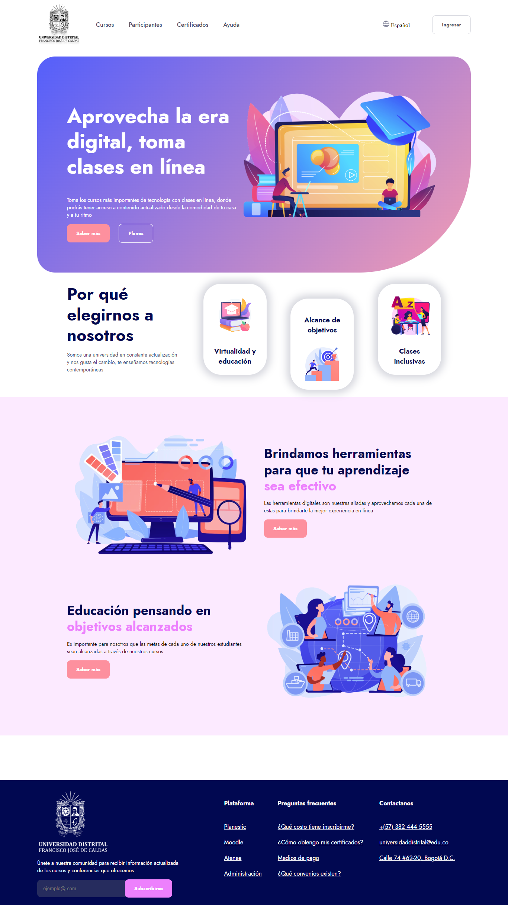
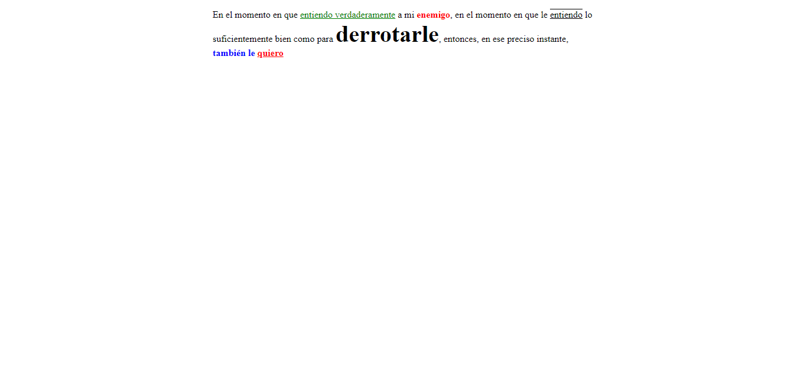
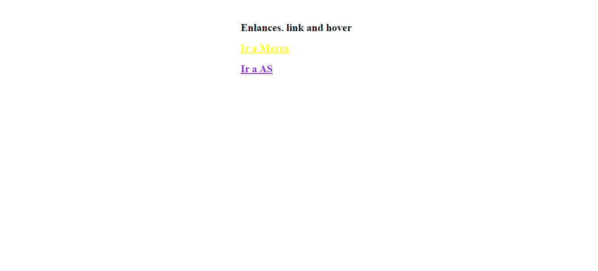
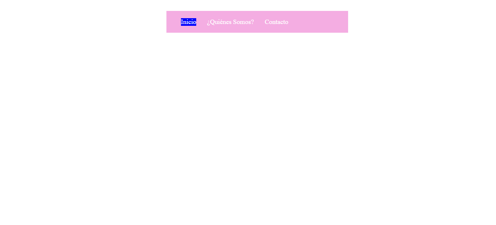
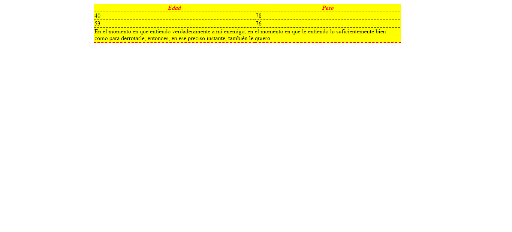

<h1>Taller 9 - Jorge Elian Guio Gonzalez</h1>

<h2>Informacion</h2>

Curso: Full stack basico grupo 1

Profesor: Cristian Patiño

<h2>Link de la pagina web</h2>
<a href="https://jorgeguio17.github.io/taller_9_full_stack/">Link de pagina web</a>

<h2>Punto 1: Link de figma</h2>
<a href="https://www.figma.com/file/qLPS0hSLUNdxfs53GOOJu2/JORGE-ELIAN-GUIO-GONZALEZ-MOCKUP-1?type=design&node-id=0%3A1&mode=design&t=G9cYyneSgtAcnqaH-1">Link de Figma</a>

<h2>Punto 2: Diseño de HTML</h2>

<h2>Punto 3: Diseño con CSS</h2>

<h2>Punto 4: Títulos</h2>

<h2>Punto 5: Párrafo</h2>

<h2>Punto 6: Links</h2>

<h2>Punto 7 y 8: Navegación</h2>

<h2>Punto 9: Tabla</h2>

